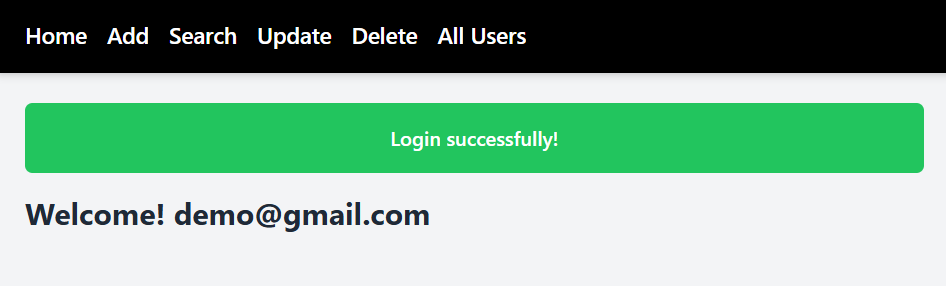
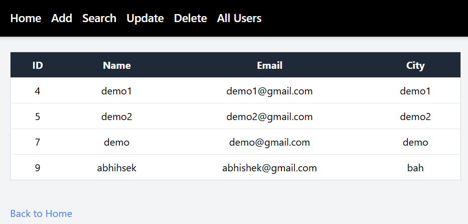
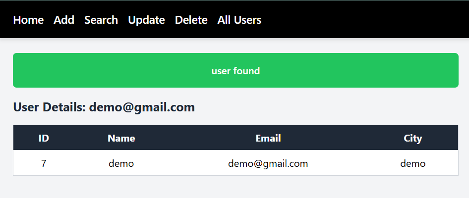

# 📝 FlaskToDo - Minimal ToDo Manager App

A simple, lightweight ToDo app built using **Flask (Python)** and **Tailwind CSS CDN**, featuring add, update, delete, search, and view all users.

---

## 📸 Screenshots

| Home Page | List Users | Search User |
|-----------|------------|-------------|
|  |  |  |

---

## ✨ Features

- 🧾 Add user (First name, Email, City)
- 🔍 Search user by email
- 🔁 Update user details
- 🗑️ Delete user
- 📃 View all users
- 📦 Flash messages for success/error
- 💅 Tailwind CSS via CDN

---

## 🧩 How to Run

1. **Clone the repository**

```bash
git clone https://github.com/abh0x1/FlaskToDo.git
cd flask-todo
````

2. **Create & activate virtual environment (optional but recommended)**

```bash
python -m venv venv
source venv/bin/activate   # On Windows: venv\Scripts\activate
```

3. **Install all dependencies**

```bash
pip install -r requirements.txt
```

4. **Run the Flask app**

```bash
python app.py
```

5. **Visit in your browser**

```
http://127.0.0.1:5000/
```

---

## 🗃️ Project Structure (if needed)

```
flask-todo/
├── static/
├── templates/
│   ├── base.html
│   ├── search.html
│   ├── update.html
│   ├── result.html
│   ├── delete.html
│   └── all_users.html
├── screenshots/
│   ├── home.png
│   ├── list.png
│   └── search.png
├── app.py
├── requirements.txt
└── README.md
```

---

## ⚖️ License

This project is licensed under the [MIT License](LICENSE).

---

## 🙋 Author

**Abhishek**
GitHub: [@abh0x1](https://github.com/abh0x1)

---

## 🧠 Inspired By

Basic CRUD apps, Flask official documentation, and modern minimal web UI with Tailwind.


